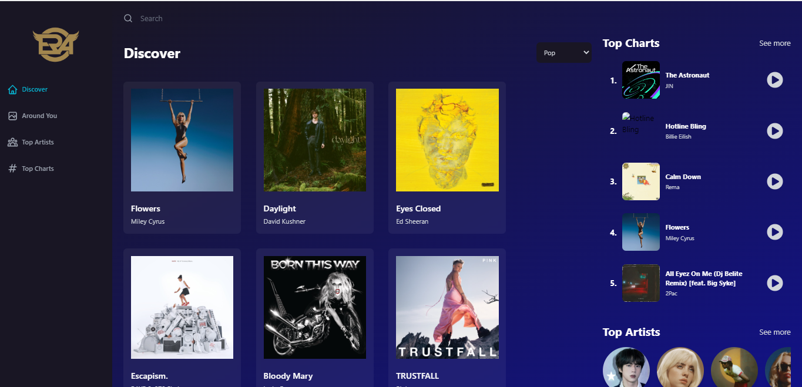
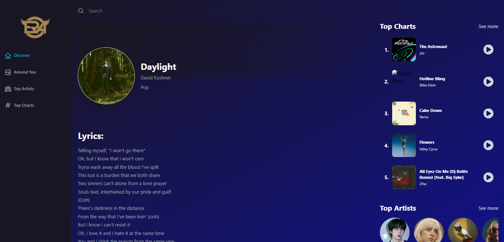
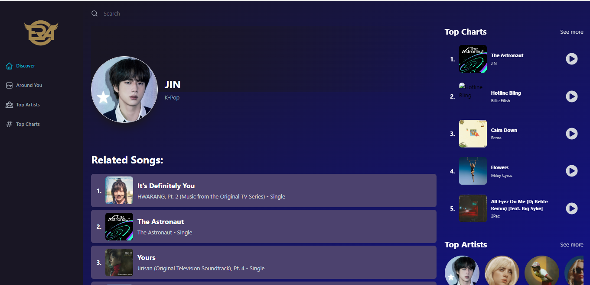
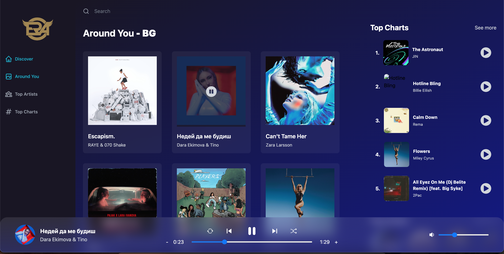
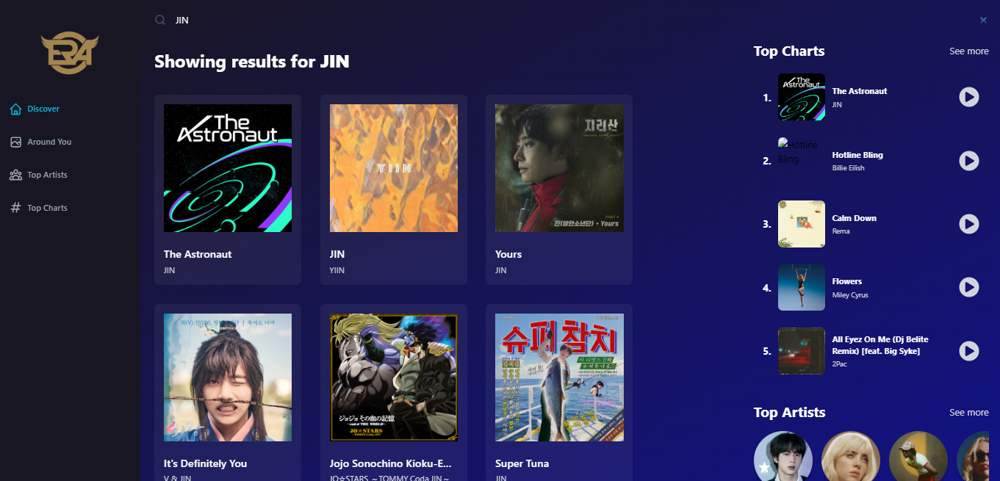
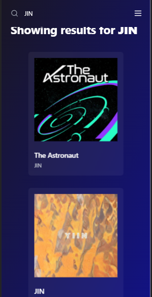
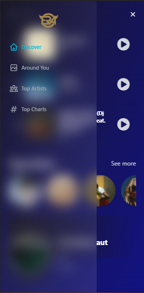

## :rocket React_Music_App 

You can view the site here
[Click Me](https://era-music-app.netlify.app/)

## :books: Table of Contents

- [About](#raised_hands-about)
- [Technologies used](#gear-technologies-used)
- [Features](#pushpin-features)
- [Before you start](#⚠️-before-you-startbefore-you-start)
- [Author](#star-author)

## :raised_hands: About
 - This is a music web app with different functionalities and navigation. It has audio player with basic controls like play, pause, repeat, shuffle, next, previous, fast-forward and volume control with an interactive GUI. It has the ability to fetch all the songs available on the internet using the search functionality, detailed information of every song and artist with lyrics, filter by genre to pick the top songs and top artists, explore the most popular songs in your country, trendings artists and worldwide top charts, data is fetched from unlimited source through API's. It is responsive and works on all the devices.
   
## :gear: Technologies used
- ReactJS
- Redux toolkit
- Redux toolkit query
- RAPID API for fetching songs data
- Tailwind css

## :pushpin: Features
<ul>
  <li>Discover Page</li>
  <li>Around You Page (shows songs recommendations with your country location)</li>
  <li>Top Charts Page</li>
  <li>Top Artist Page</li>
  <li>Music Player widget(You can play, pause, shuffle and repeat songs)</li>
</ul>

## ⚠️ Before you start
1. Make sure **Git** and **NodeJS** is installed
2. Create .env file in root folder.
3. Contents of **.env**
4. Now, to setup API, go to [Rapid API Website](https://rapidapi.com/) and create an account.
5. Enable this API to fetch music data: [API: Shazam Core by Tipsters CO](https://rapidapi.com/tipsters/api/shazam-core/ "API: Shazam Core by Tipsters CO").
6. After enabling you can get your API Keys and paste them in `.env` file in `VITE_SHAZAM_CORE_RAPID_API_KEY`.
**NOTE:** Make sure you don't share these keys publicaly.

How to use this App?

1. Clone this **repository** to your local computer.
2. Open **terminal** in root directory.
3. Type and Run `npm install` or `yarn install`.
4. Once packages are installed, you can start this app using `npm run dev`.
5. Now app is fully configured and you can start using this app :+1:.

## :star: Author

Ramadan Emin

